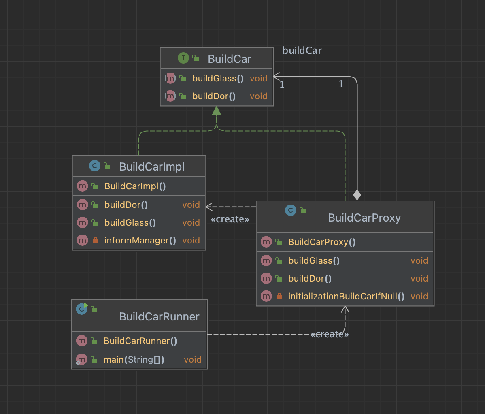

# Overview
The Proxy pattern allows us to create an intermediary that acts as an interface to another resource, while also hiding the underlying complexity of the component.

# When to use Proxy Pattern

- When we want a simplified version of a complex or heavy object. In this case, we may represent it with a skeleton object which loads the original object on demand, also called as lazy initialization. This is known as the Virtual Proxy
- When the original object is present in different address space, and we want to represent it locally. We can create a proxy which does all the necessary boilerplate stuff like creating and maintaining the connection, encoding, decoding, etc., while the client accesses it as it was present in their local address space. This is called the Remote Proxy
- When we want to add a layer of security to the original underlying object to provide controlled access based on access rights of the client. This is called Protection Proxy

# Diagram

